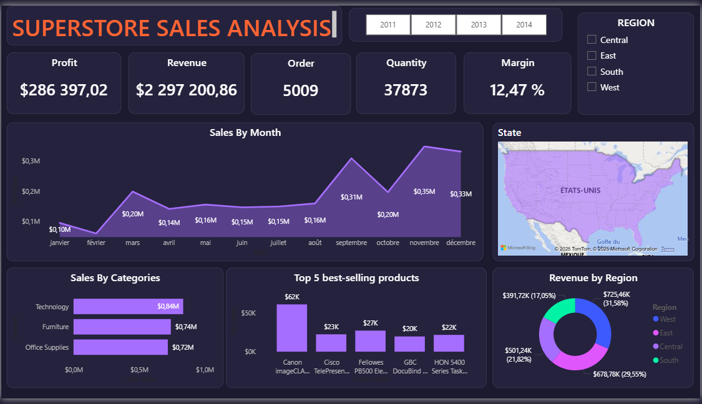

# FUTURE_DS_01 - TASK 1

# Superstore Sales Performance Dashboard 📊 TASK 1

## 📌 Overview
This project focuses on analyzing sales data from a retail superstore to identify key growth drivers and profitability leaks. I developed a high-end "Dark Mode" dashboard to provide actionable insights for executive decision-making.

## 🛠️ Tech Stack & Skills
- **Tool:** Microsoft Power BI
- **Data Source:** Excel/CSV (5,000+ rows)
- **Data Cleaning:** Power Query (ETL)
- **Analysis:** DAX (Data Analysis Expressions) for KPIs (YoY Growth, Profit Margins)
- **Visualization:** Advanced UI/UX Design (Neon Purple Theme)

## 🔍 Key Insights & Recommendations
- **Seasonality:** Identified a 40% revenue spike in Q4.
- **Profitability:** Recommended a 20% discount cap on low-margin furniture items.
- **Geography:** Highlighted untapped potential in the "Central" region.

## 📸 Dashboard Preview

## 📂 Project Structure
- `/Data`: Raw and cleaned datasets.
- `/Dashboard`: The .pbix Power BI file.
- `/Report`: PDF including full business analysis and recommendations.
